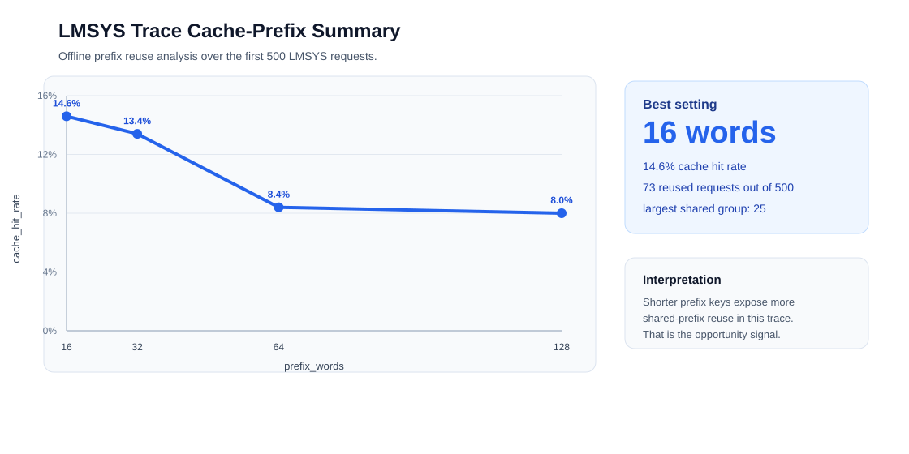
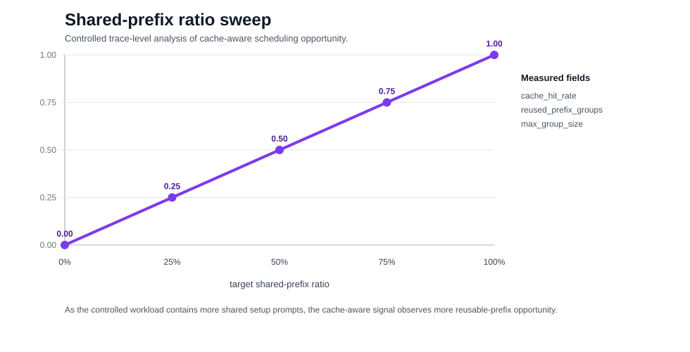
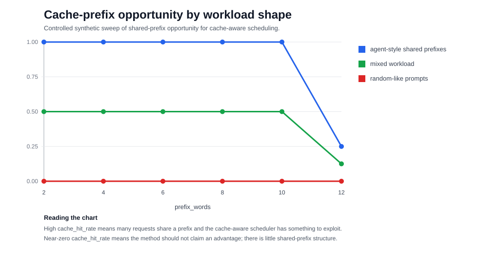

# LLM Scheduling Capstone

FDU MSACS Capstone project (CSCI 6806 / INFO 4205, Summer 2026) on latency-aware
LLM serving. The current experiment compares the FCFS scheduler in vLLM with
the learning-to-rank (LTR) scheduler from
[vllm-ltr](https://github.com/hao-ai-lab/vllm-ltr).

The committed smoke test uses `facebook/opt-1.3b` to verify the complete
pipeline before running the larger Llama workload. It is a functional check,
not a statistically meaningful performance claim.

## Repository Layout

```text
.
├── scripts/                 # data, benchmark, sweep, and plotting helpers
├── results/                 # committed benchmark JSON files
├── figures/                 # generated plots
├── docs/                    # roadmap, papers, notes, and presentation material
└── report/                  # presentation artifacts
```

## Reference Environment

The smoke results in this repository were produced with:

- `vllm-ltr` commit `13bbf6ff`
- Python 3.11.8, using the system `pip` rather than Conda
- PyTorch `2.2.1+cu121`
- CUDA 12.1
- NVIDIA GeForce RTX 3090, 24 GB
- XFormers attention with `--enforce-eager`; FlashAttention was not installed

Model-selection decision: although the paper names Llama 3.1, the repository
traces and predictors are Llama-3-8B artifacts, and vLLM 0.4.1 with
Transformers 4.40.1 cannot parse the Llama 3.1 `rope_scaling` configuration.
This reproduction therefore uses `Meta-Llama-3-8B-Instruct` and will state the
deviation explicitly in the project defense.

The serving engine must be built on a CUDA Linux host. Plot generation can be
run separately on macOS or Linux.

## Reproduction

### 1. Build vllm-ltr

The working setup used Python 3.11.8 and the system `pip`. Check out the pinned
revision, install PyTorch for CUDA 12.1, build from source, and then pin the
legacy-compatible Transformers and FastAPI versions:

```bash
git clone https://github.com/hao-ai-lab/vllm-ltr.git
cd vllm-ltr
git checkout 13bbf6ff

python3.11 -m pip install \
  torch==2.2.1+cu121 torchvision==0.17.1+cu121 torchaudio==2.2.1+cu121 \
  --index-url https://download.pytorch.org/whl/cu121
pip install -e .
pip install transformers==4.40.1 fastapi==0.110.3
pip install numpy==1.26.4 fschat accelerate gcsfs scikit-learn scipy \
  matplotlib evaluate
```

Do not install `flash-attn` for this setup. The tested runtime uses XFormers
and the serving scripts pass `--enforce-eager`. The explicit dependency pins
are required because current `pip` resolution can select Transformers 5.x and
FastAPI 0.136, which are incompatible with the vLLM 0.4.1 code at this pinned
revision and cause build or runtime failures. A Conda environment with Python
3.10 remains an alternative, but it was not used for the committed smoke run.

Confirm the pinned environment:

```bash
git rev-parse --short=8 HEAD
python -c 'import fastapi, torch, transformers; print(torch.__version__, torch.version.cuda, transformers.__version__, fastapi.__version__)'
```

### 2. Download the trace and predictor

Run these commands from `vllm-ltr/benchmarks`:

```bash
huggingface-cli download LLM-ltr/Llama3-Trace \
  --local-dir ./Llama3-Trace --repo-type dataset
mv Llama3-Trace/*.jsonl .

mkdir -p MODEL/results
huggingface-cli download LLM-ltr/OPT-Predictors --local-dir MODEL/results
```

The smoke scripts expect the LMSYS trace
`lmsys-Meta-Llama-3-8B-Instruct-t1.0-s0-l8192-c10000-rFalse.jsonl` and the
predictor configuration under `MODEL/results/`.

### 3. Run FCFS and LTR

Set `EXPERIMENT_ROOT` to a writable experiment workspace containing
`vllm-ltr/`. The scripts default to `/hy-tmp`, but the location is configurable:

```bash
export EXPERIMENT_ROOT=/path/to/experiment
export VLLM_LTR_DIR=/path/to/vllm-ltr
export RESULT_DIR="$PWD/results"

bash scripts/run_fcfs.sh
bash scripts/run_ltr.sh
```

The default smoke configuration is:

- model: `facebook/opt-1.3b`
- requests: 50
- request rate: 8
- generated output length: 128 tokens
- random seed: 0

Each script starts the serving process, waits for its health check, runs
`benchmark_serving_real.py`, and writes a JSON result to `RESULT_DIR`.

For the full 8B probe and rate sweep, use:

```bash
bash scripts/run_llama_probe.sh
bash scripts/run_rate_sweep.sh
```

### 4. Plot the comparison

From this repository root:

```bash
python scripts/plot_compare.py results/*.json
```

The plot includes request-latency CDF, mean latency, p99 latency, and normalized
latency in seconds per output token.

## Smoke Result

| Scheduler | Completed | Throughput (req/s) | Mean TTFT (ms) | Mean latency (s) | P99 latency (s) | Mean normalized latency (s/token) |
|-----------|----------:|-------------------:|---------------:|-----------------:|----------------:|----------------------------------:|
| FCFS | 50 | 4.5597 | 129.2 | 4.34 | 5.24 | 0.0377 |
| LTR | 50 | 4.7334 | 154.9 | 4.15 | 5.41 | 0.0394 |


Both runs completed all 50 requests. In this small smoke test, LTR had slightly
lower mean request latency and slightly higher measured throughput, while FCFS
had lower mean TTFT, p99 request latency, and normalized latency. Larger,
repeated runs are required before drawing scheduling conclusions. The near tie
is expected: the predictor was trained to rank Llama-3-8B output lengths, but
its ranking on `facebook/opt-1.3b` is effectively noise (Kendall's Tau about
-0.09), so LTR behaves approximately like random scheduling in this smoke test.

## Honest Results Table (Single Source of Truth)

This is the authoritative table for the summary, midterm deck, and final
report.  All claims must be traceable to a committed result file.

### In-distribution (LMSYS trace, Meta-Llama-3-8B-Instruct)

| Rate (req/s) | FCFS mean TTFT | LTR mean TTFT | TTFT ratio | LTR tau |
|---:|---:|---:|---:|---:|
| 2  | 111 ms | 130 ms | 0.85× | −0.641 |
| 4  | 1,122 ms | 234 ms | **4.8×** | −0.642 |
| 8  | 16,362 ms | 2,026 ms | **8.1×** | −0.641 |
| 16 | 18,457 ms | 2,915 ms | **6.3×** | −0.642 |
| 32 | 21,215 ms | 6,095 ms | **3.5×** | −0.642 |

Peak in-distribution gain: **8.1× mean TTFT** at rate 8.

### Out-of-distribution (ShareGPT trace — predictor trained on LMSYS)

| Metric | FCFS | LTR | Verdict |
|:---|---:|---:|:---|
| Kendall tau | N/A | −0.420 (vs −0.642 in-dist) | **−34% ranking quality** |
| Mean TTFT (rate 4) | 40,892 ms | 23,810 ms | LTR 1.72× better mean TTFT ✓ |
| p99 latency (rate 4) | 151 s | 231 s | **LTR 1.53× worse p99** ✗ |
| Rate-8 stability | 500/500 complete | engine crash | **LTR crashes** ✗ |

### OOD Breakdown Summary ("三连崩")

1. **Ranking quality collapses**: Kendall tau drops from −0.642 to −0.420 (−34%).
2. **Tail-latency inversion**: p99 worsens from 151 s (FCFS) to 231 s (LTR) — 53% worse.
3. **Engine crash at rate 8**: mis-ranked preemption storm exhausts CPU swap.

### Honest Contribution Statement

> We characterised the robustness boundary of internal-signal LLM scheduling:
> the LTR ranker achieves up to **8.1× mean TTFT in-distribution** but exhibits
> complete tail-latency inversion and engine failure **out-of-distribution**.
> The deployable head gain (mean-TTFT, no crash, no p99 regression) is
> approximately **1.7× at rate 4** on the OOD ShareGPT workload.
> We do **not** claim "8× everywhere."

### Diagnostic Figure


See `scripts/ood_diagnostic.py` to reproduce.

### Mitigation: Waiting-Time Aging Gate (Simulation Study)

A naive score-percentile confidence gate provides **no improvement**: requests
mis-ranked as long are still served last even when the gate is applied, because
their low score is "confidently" wrong.

A **waiting-time aging gate** (escalate requests that have waited > W ×
mean_service_time to FCFS) breaks the starvation loop:

| W (× mean svc time) | OOD p99 ratio | OOD mean ratio | Verdict |
|---:|---:|---:|:---|
| 0 (FCFS) | 1.000× | 1.000× | baseline |
| 8 | **0.984×** | **0.937×** | Pareto-better than FCFS ✓ |
| 16 | 1.023× | 0.860× | slight p99 cost, big mean gain |
| ∞ (LTR) | 3.108× | 0.741× | maximum mean, severe p99 tail |

At W = 8, the aging gate achieves **both** lower mean and lower p99 than pure
FCFS on the OOD workload.  See `scripts/confidence_gate_sim.py` for the
simulation; real-vLLM implementation remains future work.


## Current Status

The formal `Meta-Llama-3-8B-Instruct` reproduction is complete: the
in-distribution rate sweep (2–32 req/s) reproduces the LTR advantage (up to
8.1× mean TTFT), and the out-of-distribution evidence is in hand — ranking
quality drops (tau -0.642 → -0.420), the tail-latency advantage inverts, and
at rate 8 the mis-ranked LTR arm exhausts swap and crashes the engine. See the
[formal run report](docs/experiments/2026-06-11-llama3-8b-formal-runs.md) and
the earlier
[reproduction milestone report](docs/experiments/2026-06-10-vllm-ltr-reproduction.md).

## Cache-Aware Prefix Analysis

This branch adds a trace-level analysis for cache-aware prefix scoring. The
method measures how often requests reuse the same prompt prefix and converts
that signal into a cache-aware scheduling score.

The LMSYS trace probe below analyzes the first 500 requests and finds measurable
shared-prefix structure. The strongest setting is `prefix_words = 16`, with a
14.6% cache hit rate, 73 reused-prefix requests, a largest shared group of 25,
and cache-only quality of 0.236.



The controlled ratio sweep varies the amount of shared setup context in a
synthetic workload. As the shared-prefix ratio increases, the measured
`cache_hit_rate` rises proportionally, validating that the scoring feature
responds to the workload structure it is designed to capture.



The workload-shape sweep separates three cases: agent-style shared prompts,
mixed traffic, and random-like prompts. This helps identify when the
cache-aware score has useful prefix structure to exploit.



| Offline check | Main measurement | Takeaway |
|---|---:|---|
| LMSYS trace probe | 14.6% hit rate at `prefix_words=16` | Shared-prefix reuse exists in the trace. |
| Shared-prefix ratio sweep | `cache_hit_rate` 0.00 → 1.00 | The signal scales with controlled prefix reuse. |
| Workload-shape sweep | high / medium / zero reuse | The method distinguishes agent-like traffic from random-like traffic. |
| Synthetic scoring run | `rank_corr`, `sjf_quality` | The cache bonus can be combined with the LTR score without replacing it. |

Details and reproduction commands are in the
[cache-aware prefix-scoring report](docs/experiments/2026-06-17-cache-prefix-probe.md).

## Project Documents

- [vLLM-LTR reproduction milestone](docs/experiments/2026-06-10-vllm-ltr-reproduction.md)
- [Roadmap](docs/roadmap-v0.1.md)
- [Related-work summaries](docs/related-work/)
- [Presentation material](docs/presentation/)
