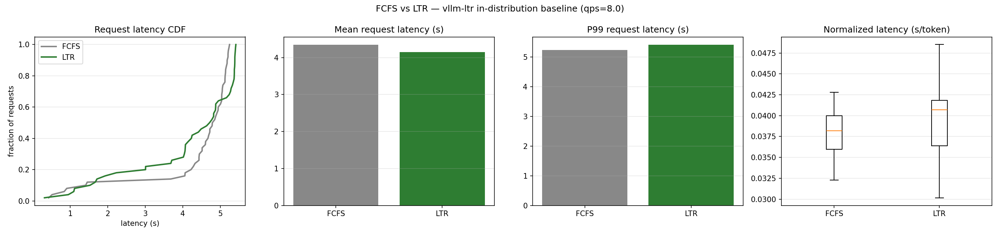

# vLLM-LTR Reproduction Milestone

Date: 2026-06-10

## Status

The end-to-end FCFS versus LTR smoke pipeline is complete and reproducible on
the pinned vLLM-LTR revision. The committed OPT-1.3B results validate the
environment, predictor integration, benchmark data path, result serialization,
and plotting workflow. They are not evidence of an LTR performance advantage.

The formal Llama-3-8B rate sweep and out-of-distribution evaluation remain
pending.

## Objective

Reproduce the learning-to-rank scheduling workflow from
[vllm-ltr](https://github.com/hao-ai-lab/vllm-ltr), compare it with FCFS under
the same workload, and establish a reliable path from environment setup through
result visualization before running the full experiment.

## Completed Work

### Source and runtime environment

- Pinned `vllm-ltr` to commit `13bbf6ff`, corresponding to vLLM 0.4.1.
- Built and ran the project with Python 3.11.8 using the system `pip`.
- Used PyTorch `2.2.1+cu121`, CUDA 12.1, and an NVIDIA RTX 3090 with 24 GB
  VRAM.
- Used XFormers attention with `--enforce-eager`; `flash-attn` was not
  installed.
- Pinned `transformers==4.40.1`, `fastapi==0.110.3`, and `numpy==1.26.4` to
  match the validated environment.

### Build and compatibility fixes

- Avoided current default dependency resolution that selects Transformers 5.x
  and FastAPI 0.136, which are incompatible with the pinned vLLM 0.4.1 code.
- Diagnosed source-build termination with exit code 137 as host cgroup memory
  pressure rather than GPU memory exhaustion.
- Reduced parallel compilation to `MAX_JOBS=4`, which allowed the editable
  source build to complete within the approximately 23 GiB host memory limit.
- Kept experiment code, caches, models, temporary files, and results on the
  large experiment volume instead of the small system disk.

### Data, predictors, and scripts

- Downloaded the Llama-3 trace datasets used by the upstream project, including
  the in-distribution LMSYS workload and additional ShareGPT/Alpaca traces for
  later out-of-distribution checks.
- Downloaded the OPT-125M length predictors and configured the LMSYS predictor
  used by the LTR scheduler.
- Added scripts for model download, FCFS, LTR, the Llama probe, the request-rate
  sweep, and result plotting:
  - [`download_llama.sh`](../../scripts/download_llama.sh)
  - [`run_fcfs.sh`](../../scripts/run_fcfs.sh)
  - [`run_ltr.sh`](../../scripts/run_ltr.sh)
  - [`run_llama_probe.sh`](../../scripts/run_llama_probe.sh)
  - [`run_rate_sweep.sh`](../../scripts/run_rate_sweep.sh)
  - [`plot_compare.py`](../../scripts/plot_compare.py)

### Smoke benchmark

The committed smoke benchmark used:

- Model: `facebook/opt-1.3b`
- Trace: LMSYS Llama-3-8B workload
- Requests: 50
- Request rate: 8 requests/second
- Generated output length: 128 tokens
- Seed: 0

Both arms completed all 50 requests. Server logs confirmed different scheduler
configurations and successful auxiliary predictor initialization for LTR.

| Scheduler | Completed | Throughput (req/s) | Mean TTFT (ms) | Mean latency (s) | P99 latency (s) | Mean normalized latency (s/token) |
|-----------|----------:|-------------------:|---------------:|-----------------:|----------------:|----------------------------------:|
| FCFS | 50 | 4.5597 | 129.2 | 4.34 | 5.24 | 0.0377 |
| LTR | 50 | 4.7334 | 154.9 | 4.15 | 5.41 | 0.0394 |

The near tie is expected. The predictor was trained for Llama-3-8B output
lengths, while its ranking for OPT-1.3B was effectively noise. The observed
Kendall's Tau was approximately `-0.09` with `p = 0.395`, so this smoke run
tests integration rather than scheduler quality.

### Llama-3-8B preparation

- Downloaded the Llama-3.1-8B-Instruct weights to the experiment volume.
- Confirmed that the model could load on the 24 GB GPU and serve a successful
  completion request.
- Added a probe that records cgroup memory watermarks and searches server logs
  for preemption evidence before starting the formal sweep.

The successful model-load check does not replace the pending full FCFS/LTR
benchmark.

### Repository artifacts

The repository now contains:

- Two raw smoke benchmark JSON files with per-request timing and output-length
  data:
  - [`FCFS result`](../../results/vllm-8.0qps-cv1.0-opt-1.3b-fcfs-20260611-074157.json)
  - [`LTR result`](../../results/vllm-8.0qps-cv1.0-opt-1.3b-opt-xxx-20260611-074716.json)
- The generated comparison figure:
  [`fcfs_vs_ltr.png`](../../figures/fcfs_vs_ltr.png)
- Reproduction instructions in the root [`README.md`](../../README.md).

No access token, login credential, server address, or external SSH port is
stored in these artifacts. Credentials remain environment-only.

## Lessons Learned

1. Reproducing an older serving stack requires pinning transitive dependencies,
   not just the upstream Git commit.
2. Host cgroup limits must be checked directly; machine-wide free memory can
   give a misleading picture inside a constrained environment.
3. Build parallelism is a major memory control for CUDA extension compilation.
4. A small-model smoke test can prove wiring and data integrity, but cannot
   establish the scheduler's performance when the predictor is out of domain.
5. FCFS and LTR must use identical model, trace, seed, request rate, output
   policy, and memory settings for a meaningful comparison.

## Remaining Work

- Complete the Llama-3-8B memory/preemption probe for both scheduler arms.
- Run FCFS and LTR at request rates `2`, `4`, `8`, `16`, and `32`, producing
  ten comparable result files.
- Run at least one ShareGPT out-of-distribution comparison with the LMSYS
  predictor.
- Generate the formal comparison figures and summarize mean, tail, normalized,
  and time-to-first-token latency.
- Repeat measurements where necessary before making paper-level performance
  claims.

## Completion Criteria

The reproduction will be considered complete when the full Llama-3-8B sweep
and out-of-distribution run finish without resource-policy violations, their raw
results and plots are committed, and conclusions distinguish integration
validation from statistically supported scheduling effects.
