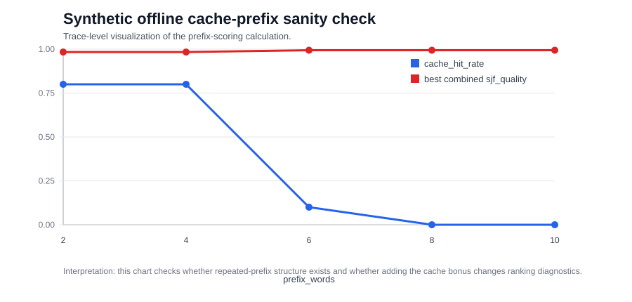

# Cache-Aware Prefix Scoring

Date: 2026-06-17

## Status

This branch develops a cache-aware prefix-scoring method. The method reads a
request trace, detects whether multiple prompts share the same prefix, and
turns that prefix reuse into an extra scheduling score.

The method keeps the base LTR idea, but adds a cache-reuse signal:

```text
final_score = normalized_ltr_score + cache_weight * normalized_cache_bonus
```

The implementation produces reproducible offline diagnostics and a score-file
path that can be used by the scheduler integration.

## Goal

The goal is to connect the shared-prefix related-work direction to the team's
scheduler experiment. The base LTR scheduler ranks requests using predicted
output length. This method asks a different question:

> If two or more requests share the same beginning context, should the scheduler
> give them a small priority bonus because they may create cache-reuse value?

Base paper signal:

- predicted output length / LTR score

Added signal:

- shared-prefix or cache-reuse opportunity

The high-level idea is still simple:

```text
final_score = LTR_score + cache_bonus
```

If a request is predicted to be short, the LTR score already helps it run
earlier. If the same request also shares a prefix with other requests, the
method adds a small cache bonus.

## Motivation

This method comes from the shared-prefix related-work thread. Shared prefixes
are important in LLM serving, especially for chatbots, RAG, agents, tool-use
prompts, and repeated system prompts.

- Hydragen shows that shared prefixes can affect inference efficiency.
- CacheGen and CachedAttention show that cache reuse and repeated context have
  real latency cost.
- vLLM-LTR focuses on scheduling by predicted output length, but does not
  directly use shared-prefix reuse as a scheduling feature.

The method turns that shared-prefix observation into a scheduler-level feature.
It is smaller than implementing a full cache system, but it can be coded,
tested, and connected to the scheduler validation path.

## What the Script Does

Script:

```text
scripts/cache_prefix_probe.py
```

The script:

1. Loads prompts from a trace file.
2. Normalizes each prompt and extracts the first N words as its prefix.
3. Counts how many requests share each prefix.
4. Gives a larger cache bonus to requests whose prefix appears more than once.
5. Optionally combines this cache bonus with the original LTR scores from an
   existing result JSON.
6. Reports rank-correlation and SJF-quality style diagnostics.

This probe is trace-based and leaves the vLLM scheduler code unchanged.

Second script:

```text
scripts/build_cache_aware_score_file.py
```

This script converts the final score into a prompt-to-score JSON file. That file
can be passed into the existing scheduler integration through `IPT_SCORE_FILE`,
so the method has a concrete path from trace analysis to scheduler scoring.

## Calculation

The calculation has four steps:

1. Normalize each prompt by lowercasing it and collapsing repeated spaces.
2. Extract the first `prefix_words` words as the request's prefix key.
3. Count how many requests share the same prefix key.
4. Convert that repeated-prefix count into a cache bonus:

```text
cache_bonus = log1p(shared_prefix_group_size - 1) * prefix_words
```

Then the LTR score and cache bonus are standardized so they are on comparable
scales:

```text
z = (value - mean) / std
```

The final score is:

```text
final_score = z_ltr_score + cache_weight * z_cache_bonus
```

The output is a scheduler-score diagnostic. It answers: "does the cache-aware
feature change ranking in a measurable way, and does this workload have enough
shared-prefix structure to justify using the cache bonus?"

## Metric Definitions

| Metric | Meaning |
|---|---|
| `cache_hit_rate` | Fraction of requests whose prefix appears in at least one other request. |
| `reused_prefix_groups` | Number of repeated-prefix groups in the trace. |
| `max_group_size` | Size of the largest group sharing the same prefix. |
| `rank_corr` | Correlation between scheduling score rank and true output-length rank. |
| `sjf_quality` | Negative `rank_corr`; larger values better match shortest-job-first ordering. |

## LMSYS Trace Offline Probe

The first trace-level probe uses the first 500 LMSYS requests and sweeps prefix
lengths `16`, `32`, `64`, and `128`. This checks whether shared-prefix reuse is
visible in the same family of traces used by the vLLM-LTR experiments.

Files:

```text
results/cache-prefix-lmsys-offline-summary.json
figures/cache_prefix_lmsys_trace_summary.svg
scripts/plot_cache_prefix_lmsys_trace_summary.py
```

Command:

```bash
python3 scripts/plot_cache_prefix_lmsys_trace_summary.py \
  --input results/cache-prefix-lmsys-offline-summary.json \
  --out figures/cache_prefix_lmsys_trace_summary.svg
```


Summary:

| `prefix_words` | `cache_hit_rate` | Reused requests | `cache_only_quality` |
|---:|---:|---:|---:|
| 16 | 14.6% | 73 | 0.236 |
| 32 | 13.4% | 67 | 0.223 |
| 64 | 8.4% | 42 | 0.206 |
| 128 | 8.0% | 40 | 0.198 |

The strongest first setting is `prefix_words = 16`: it finds the most reuse,
the largest cache hit rate, and the highest cache-only quality. This supports
using shared-prefix reuse as a candidate scheduler feature.

Additional summary at `prefix_words = 16`:

| Metric | Value |
|---|---:|
| Requests analyzed | 500 |
| Reused-prefix requests | 73 |
| Largest shared group | 25 |
| Cache hit rate | 14.6% |
| Cache-only quality | 0.236 |

## Controlled Synthetic Checks

The synthetic checks below are controlled experiments. They are included to
verify that the cache-prefix measurement responds predictably when the workload
structure changes.

### Local Sanity Check

The repository includes a tiny hand-written demo trace and a tiny baseline
score file for checking that the script runs locally.

```text
results/cache-prefix-probe-demo-trace.jsonl
results/cache-prefix-probe-demo-ltr.json
```

Run from this repository root:

```bash
python3 scripts/cache_prefix_probe.py \
  --trace results/cache-prefix-probe-demo-trace.jsonl \
  --result-json results/cache-prefix-probe-demo-ltr.json \
  --n 8 \
  --prefix-words 6 10 \
  --weights 0.1 0.5 1.0 \
  --out /tmp/cache-prefix-probe-demo-output.json
```

Expected behavior:

- the script should load all 8 requests;
- the travel-agent and coding-tutor requests should be detected as repeated
  prefix groups;
- the output JSON should include `cache_only`, `base_ltr`, `combined`, and
  `best_combined_result` fields.

### Workload-Shape Opportunity Sweep

To make the evidence clearer, the branch adds a controlled synthetic sweep with
three workload shapes:

- `agent_shared_prefix`: many requests share long setup prompts.
- `mixed_prefix`: some requests share setup prompts and some are independent.
- `random_like`: requests are intentionally different from the first token.

This sweep measures whether the cache-aware method has prefix reuse to exploit.

Files:

```text
scripts/cache_prefix_opportunity_sweep.py
results/cache-prefix-opportunity-sweep.json
figures/cache_prefix_opportunity_sweep.svg
```

Command:

```bash
python3 scripts/cache_prefix_opportunity_sweep.py \
  --json-out results/cache-prefix-opportunity-sweep.json \
  --svg-out figures/cache_prefix_opportunity_sweep.svg
```


What this shows:

- In the agent-style shared-prefix workload, `cache_hit_rate` stays high for
  most prefix lengths, so cache-aware scheduling has a real opportunity.
- In the mixed workload, `cache_hit_rate` is around 0.50 for most tested prefix
  lengths, which means the method may help only part of the traffic.
- In the random-like workload, `cache_hit_rate` is 0.00, so the method should
  not claim an advantage.

This result defines the condition under which the method is expected to matter:
repeated prompt prefixes must actually exist.

### Shared-Prefix Ratio Sweep

The branch also adds a ratio sweep that controls how much of the workload
contains a shared setup prefix. The trace size stays fixed at 40 requests, and
the target shared-prefix ratio varies from 0% to 100%.

Files:

```text
scripts/cache_prefix_ratio_sweep.py
results/cache-prefix-ratio-sweep.json
figures/cache_prefix_ratio_sweep.svg
```

Command:

```bash
python3 scripts/cache_prefix_ratio_sweep.py \
  --json-out results/cache-prefix-ratio-sweep.json \
  --svg-out figures/cache_prefix_ratio_sweep.svg
```


Summary:

| Target shared-prefix ratio | `cache_hit_rate` | `reused_prefix_groups` | `max_group_size` |
|---:|---:|---:|---:|
| 0% | 0.00 | 0 | 1 |
| 25% | 0.25 | 2 | 5 |
| 50% | 0.50 | 4 | 5 |
| 75% | 0.75 | 6 | 5 |
| 100% | 1.00 | 8 | 5 |

This sweep gives a clearer data story than a single demo trace: the method's
opportunity signal scales with the amount of repeated-prefix structure in the
workload.

### Synthetic Scoring Result

The branch also includes one small synthetic scoring experiment. It checks whether the
prefix-based calculation behaves as expected on a trace with known
shared-prefix groups.

Files:

```text
results/cache-prefix-probe-synthetic-trace.jsonl
results/cache-prefix-probe-synthetic-ltr.json
results/cache-prefix-probe-synthetic-output.json
figures/cache_prefix_probe_synthetic.svg
```

Command:

```bash
python3 scripts/cache_prefix_probe.py \
  --trace results/cache-prefix-probe-synthetic-trace.jsonl \
  --result-json results/cache-prefix-probe-synthetic-ltr.json \
  --n 20 \
  --prefix-words 2 4 6 8 10 \
  --weights 0.1 0.3 0.5 1.0 \
  --out results/cache-prefix-probe-synthetic-output.json

python3 scripts/plot_cache_prefix_probe.py \
  --input results/cache-prefix-probe-synthetic-output.json \
  --out figures/cache_prefix_probe_synthetic.svg
```



What this shows:

- With short prefix keys (`prefix_words` 2 or 4), 16 of 20 requests share a
  prefix with another request, so `cache_hit_rate = 0.80`.
- With longer prefix keys (`prefix_words` 8 or 10), the synthetic prompts become
  unique, so `cache_hit_rate = 0.00`.
- The best combined ranking diagnostic stays close to the baseline LTR
  diagnostic at small cache weight. This is useful as a sanity check because it
  shows the cache bonus can be added without completely replacing the LTR score.

The takeaway is that the script can detect shared-prefix structure and produce
a scheduler score file from trace data.

## Example Commands

In-distribution LMSYS:

```bash
cd /hy-tmp/vllm-ltr/benchmarks
python3 /hy-tmp/scripts/cache_prefix_probe.py \
  --trace lmsys-Meta-Llama-3-8B-Instruct-t1.0-s0-l8192-c10000-rFalse.jsonl \
  --result-json /hy-tmp/results/llama3-8b/vllm-8.0qps-cv1.0-Meta-Llama-3-8B-Instruct-opt-xxx-20260611-104730.json \
  --out /hy-tmp/results/cache-prefix-probe-lmsys.json
```

OOD ShareGPT:

```bash
cd /hy-tmp/vllm-ltr/benchmarks
python3 /hy-tmp/scripts/cache_prefix_probe.py \
  --trace llama3-8b-sharegpt-test-t1-s0-8192.jsonl \
  --result-json /hy-tmp/results/llama3-8b/vllm-4.0qps-cv1.0-Meta-Llama-3-8B-Instruct-opt-xxx-20260611-113821-ood-sharegpt.json \
  --out /hy-tmp/results/cache-prefix-probe-sharegpt.json
```

## How to Read Output

The output JSON uses fields specific to this cache-prefix method:

- `requests_with_reused_prefix`: how many requests share a prefix with another
  request.
- `cache_hit_rate`: fraction of requests whose prefix appears more than once.
- `cache_only`: ranking diagnostic using only the cache bonus.
- `base_ltr`: ranking diagnostic using only the original LTR score.
- `combined`: ranking diagnostic after adding the cache bonus to LTR.
- `best_combined_result`: best tested `prefix_words` and `cache_weight`
  combination by this offline ranking metric.

The two ranking fields are:

- `rank_corr`: correlation between scheduling score rank and true output-length
  rank.
- `sjf_quality`: negative `rank_corr`, because a shortest-job-first style
  scheduler is better when high priority is associated with shorter output.

The signal would be promising if:

- `combined` improves over `base_ltr`, especially on OOD data, or
- it does not improve rank correlation but shows many reused-prefix opportunities,
  which means it may still be useful for prefill-oriented scheduling.

## What This Branch Contributes

This contribution is different from the team's reproduction run and uses its
own measurements. What it contributes is:

- a concrete cache-aware scoring rule;
- a script that measures prefix reuse in a trace;
- a script that exports cache-aware scheduler scores;
- a local sanity check that other teammates can rerun;
- a clear score-file path for scheduler validation.

This branch contributes code and methodology for the cache-aware direction.

## Limitation

The cache bonus can hurt if prefix reuse does not align with shorter outputs or
better batching. This is why the branch reports prefix opportunity and ranking
diagnostics before expanding the method further.

## Proposed Next Validation

The next validation should stay aligned with the cache-prefix method instead of
copying the team's latency table. A suitable validation path has three stages:

1. Run the prefix-opportunity sweep on a real trace without starting vLLM.
2. If repeated prefixes exist, export a cache-aware score file and compare
   offline ranking diagnostics against the no-cache score.
3. Use the exported score file in a serving check once the validation
   environment is ready.

The key first question is: "does this workload contain enough shared-prefix
structure for the cache-aware score to matter?" If the offline prefix
opportunity is near zero, then the method should be reported as not applicable
to that workload rather than pushed into a larger serving run.
