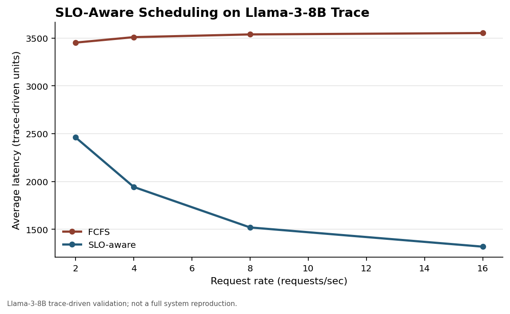
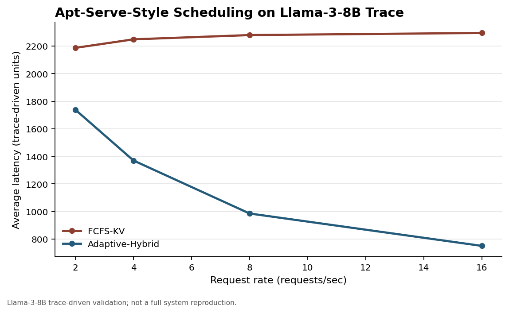

# SLO-Aware and Apt-Serve Scheduling Probes

**Scope warning:** this folder is Shun Huang's related-work probe only. It is
not a replacement for the team's shared base-paper reproduction, and it should
not be used to rewrite the repository-level LTR/FCFS headline results.

This folder contains paper-inspired probes for two related scheduling papers:

- `SLO-Aware Scheduling for Large Language Model Inferences`
- `Apt-Serve: Adaptive Request Scheduling on Hybrid Cache for Scalable LLM Inference Serving`

These scripts are not full vLLM implementations of the original systems. They
are simulation-level and trace-driven checks used to decide which scheduling
signals are useful to combine with the base LTR scheduler.

## What These Results Support

The safe conclusion is: SLO-aware priority and Apt-Serve-style cache/batch
awareness are useful candidate signals for improving the base LTR scheduler,
but the evidence here is probe-level evidence, not full hardware reproduction.

| Evidence | Safe claim | Do not claim |
|----------|------------|--------------|
| `outputs/` | Early SLO-aware priority improves SLO attainment under several loads | SLO-aware always reduces latency |
| `outputs_sa/` | Simulated-annealing SLO-aware priority improves SLO attainment and modestly lowers mean latency in this synthetic model | Full reproduction of the SLO-aware paper |
| `outputs_aptserve/` | Adaptive hybrid cache scheduling improves SLO attainment and mean latency in this synthetic model, with high variance at the heaviest load | Full reproduction of Apt-Serve runtime/cache implementation |
| `related_bigmodel_results/` | Llama-3-8B trace-derived probe shows latency-reduction potential under a separate synthetic latency model | Real vLLM serving results for SLO-Aware or Apt-Serve |

## Result Sets

There are four result sets in this folder. They should be interpreted
separately.

| Path | Scope | Main supported conclusion |
|------|-------|---------------------------|
| `outputs/` | early synthetic SLO-aware probe | SLO-aware priority improves SLO attainment, but average latency is not consistently lower under high load |
| `outputs_sa/` | simulated-annealing SLO-aware probe over five seeds | more paper-aligned SLO-aware scheduling simulation; still synthetic |
| `outputs_aptserve/` | synthetic Apt-Serve-style hybrid-cache probe over five seeds | adaptive hybrid scheduling lowers mean latency in this simulation, but high-load variance is large |
| `related_bigmodel_results/` | supplementary Llama-3-8B trace-driven probe | later trace-derived check showing latency-reduction potential under a different workload setting |

The early synthetic CSVs and the later trace-driven CSV use different request
rates and workload assumptions. Do not compare their numbers as if they came
from one experiment.

## Run Synthetic SLO-Aware Probe

```powershell
python .\run_slo_reproduction.py
```

This creates `outputs/`:

- `workload.csv`: generated request trace.
- `results.csv`: SLO attainment and average latency by request rate and policy.
- `slo_attainment.svg`: SLO attainment chart.
- `average_latency.svg`: average latency chart.

The strongest conclusion from this early probe is improved SLO attainment, not
stable average-latency reduction.

## Run Simulated-Annealing SLO-Aware Probe

```powershell
python .\run_slo_sa_reproduction.py
```

This creates `outputs_sa/`:

- `workload.csv`: generated workload trace.
- `served_requests.csv`: per-request serving outcome.
- `results_by_seed.csv`: aggregate metrics for each random seed.
- `results_summary.csv`: mean/std across five random seeds.
- `results.csv`: same content as `results_summary.csv` for convenience.
- `slo_attainment.svg`: FCFS vs simulated-annealing SLO-aware scheduling.
- `average_latency.svg`: average latency comparison.

This version is closer to the SLO-aware paper's priority-mapping idea, but it
still uses a synthetic latency model rather than a real vLLM serving loop.

## Run Apt-Serve Probe

```powershell
python .\run_aptserve_probe.py
```

This creates `outputs_aptserve/`:

- `workload.csv`: generated workload trace.
- `served_requests.csv`: per-request serving outcome.
- `results_by_seed.csv`: aggregate metrics for each random seed.
- `results_summary.csv`: mean/std across five random seeds.
- `results.csv`: same content as `results_summary.csv` for convenience.
- `slo_attainment.svg`: FCFS with KV cache vs adaptive hybrid-cache scheduling.
- `average_batch_size.svg`: average admitted batch size under memory pressure.

This is also simulation-level. It does not implement Apt-Serve's vLLM runtime
changes or CUDA kernels. It tests the paper's core intuition that KV-cache
memory pressure affects batch composition and latency.

## Supplementary Trace-Driven Probe

`related_bigmodel_results/summary.csv` contains a later Llama-3-8B
trace-driven probe. It is kept as supplementary evidence because it uses a
different trace-derived workload setting from the early synthetic CSVs.

**Probe warning:** these trace-driven numbers still use a synthetic latency
model. They are not real vLLM hardware measurements and should not be presented
as a full reproduction of SLO-Aware Scheduling or Apt-Serve.

The trace-driven result can be cited as latency-reduction potential. In this
probe, the SLO-aware policy lowers the modeled average latency by 28.7% to
62.9% over rates 2 to 16, while the Apt-Serve-style adaptive hybrid policy
lowers modeled average latency by 20.5% to 67.3% over the same rates. These
numbers should always be labeled as trace-driven simulation results.





## Presentation Wording

Suggested wording for slides or summary:

> My related-work experiment does not implement the full SLO-Aware or Apt-Serve
> systems inside vLLM. Instead, I use synthetic and Llama-3-8B trace-derived
> probes to test whether their scheduling signals are useful. The main result is
> that SLO urgency and cache/batch awareness are promising add-on signals for
> the base LTR scheduler, but they should be evaluated later in a real scheduler
> implementation.
